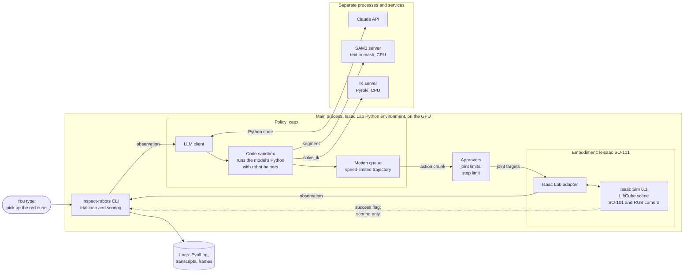
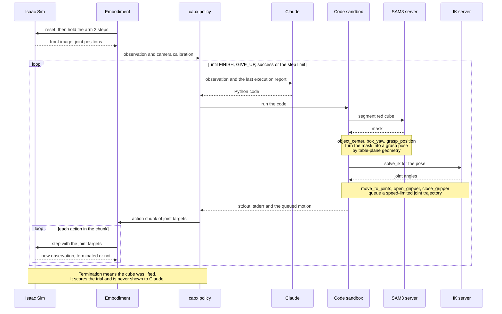

# inspect-robots-leisaac

A LeIsaac SO-101 embodiment for [Inspect Robots](https://github.com/robocurve/inspect-robots).
It specialises `inspect-robots-isaacsim` for the SO-101 arm in LeIsaac tasks such as
`LeIsaac-SO101-LiftCube-v0`, and carries the perception glue for code-as-policy runs.

## Requirements

- Isaac Sim 6.1 and Isaac Lab 3.0 (Python 3.12), plus a GPU.
- The `leisaac` package, ported to Isaac Lab 3.0, installed in the same environment.
- LeIsaac's USD assets (`robots/so101_follower.usd` and the task scene).

## Usage

```bash
OMNI_KIT_ACCEPT_EULA=YES inspect-robots "lift the cube" --policy agent \
    -P model=anthropic/claude-fable-5 -P images=on_demand --max-steps 1500 \
    --embodiment leisaac -E assets_root=/path/to/leisaac/assets
```

Pass `-E headless=false` to open an Isaac Sim viewport. `--max-steps 1500` matches LiftCube's
25 s episodes at 60 Hz; the default of 300 steps is only 5 s.

## Architecture: how the agentic loop works

You type a command. One LLM turns it into Python, small helpers supply perception, geometry and
inverse kinematics, the motion is limit-checked and played in the simulator, and the model reads
the result before its next turn. GitHub renders the diagrams below.



- **CLI and trial loop:** `inspect-robots` resets the scene, alternates policy and embodiment
  until the trial ends, scores it, and writes the log. `--epochs 8` repeats it with seeded cube
  placements.
- **Policy, `capx`:** one LLM in a write-code, read-the-result loop. It sees the front image, the
  joint positions and the last run's output. It is not several cooperating agents.
- **Code sandbox and helpers:** the model's Python runs in the same process (this is not a
  security sandbox). The helpers are perception (`segment`, served by SAM3), table-plane geometry
  (`object_center`, `box_yaw`, `top_down_quat`, `grasp_position`), inverse kinematics (`solve_ik`,
  served by Pyroki) and motion (`move_to_joints`, `open_gripper`, `close_gripper`).
- **Motion queue and approvers:** motion calls queue a speed-limited joint trajectory. Approvers
  clamp each action to the joint limits and cap the change per step, so the model cannot command
  a jump.
- **Embodiment, `leisaac`:** takes six absolute joint targets in radians at 60 Hz. It returns the
  front image, joint positions, and the camera calibration and table height as extras.
- **Isaac Sim:** the LeIsaac `LiftCube` scene with the SO-101, a cube, a table and an RGB camera.
- **SAM3 and IK servers:** separate processes in separate Python environments, called over HTTP
  and run on the CPU so the GPU stays with the simulator.
- **Claude API:** the only call that leaves the machine.
- **Success flag:** the simulator ends the episode when the cube is lifted. It scores the trial
  and is never shown to the model.

One trial, step by step:



**How the plain `agent` policy differs.** It has no sandbox, helpers or servers. Claude calls
`move_joints` and `take_pic` tools and chooses joint angles from the image alone, so it has to
judge depth and gripper alignment by eye. The results below show what that costs.

**Where each piece lives**

| Piece | Location |
|---|---|
| `capx` policy, sandbox, motion queue, server clients | `plugins/inspect-robots-capx` |
| `leisaac` embodiment, geometry, helper pack | `plugins/inspect-robots-leisaac/src/inspect_robots_leisaac` |
| Isaac Lab adapter the embodiment builds on | `plugins/inspect-robots-isaacsim` |
| SAM3 and IK servers, SO-101 URDF | `plugins/inspect-robots-leisaac/servers` |
| `LiftCube` task and robot assets | the leisaac repo, `source/leisaac/leisaac/tasks/lift_cube` |

## Action and state

The action is six absolute joint targets in radians: `shoulder_pan`, `shoulder_lift`,
`elbow_flex`, `wrist_flex`, `wrist_roll`, `gripper`. Bounds come from the SO-101 USD joint
limits, except that the gripper's low end is 0 (closed): commanding past 0 only squeezes harder
and ejected the cube in simulation. State is the six joint positions. Success is read from the
task's termination (`terminated_implies_success=True`), since LeIsaac tasks end an episode on success.

After `reset()` the embodiment holds the arm for `settle_steps` (default 2) physics steps. The
camera frame straight after `env.reset` lags it and shows the previous cube placement.

## Observation extras

`Observation.extra` carries the fixed camera's `intrinsics` (3x3), `extrinsics` (4x4, camera to
robot base, optical convention) and `table_z`, read once per episode.

## Code-as-policy (capx) without depth

The camera is RGB only, so objects are located by intersecting mask pixels with the table plane
(`geometry.py`, about 1 mm accurate in simulation for a cube). Three processes cooperate:

```bash
# 1. SAM3 segmentation server. Needs access to the gated facebook/sam3 weights on Hugging Face
#    (request access, then `hf auth login`) and a Python 3.12 venv with torch 2.10 and `sam3`.
#    On a 12 GB GPU shared with the simulator use --device cpu (about 4.7 s per request).
python servers/sam3_server.py --port 8114 --device cpu    # --selftest IMAGE PROMPT checks it

# 2. IK server: separate venv, CPU only, needs `pyroki`.
python servers/so101_ik_server.py --port 8116        # --selftest runs a round-trip check

# 3. The run, in the Isaac Lab environment with the inspect-robots plugins installed.
OMNI_KIT_ACCEPT_EULA=YES inspect-robots "pick up the red cube" --policy capx \
    -P model=anthropic/claude-sonnet-5-5 -P effort=low -P max_llm_calls=15 -P max_speed_frac=0.3 \
    -P helpers=inspect_robots_leisaac.helpers:table_top_helpers \
    -P sam3_url=http://127.0.0.1:8114 -P pyroki_url=http://127.0.0.1:8116 \
    --max-steps 1500 --store-frames --embodiment leisaac -E assets_root=/path/to/leisaac/assets
```

`servers/so101_ik_server.py` speaks the CaP-X `/ik` protocol with Pyroki and the SO-101 URDF
(`servers/so101_leisaac.urdf`, from SO-ARM100, Apache-2.0, with the simulator's joint limits).
Poses are in the simulated base frame, which differs from the URDF base frame by a fixed
transform fitted to 0.3 mm. It solves top-down targets exactly out to about 0.30 m from the base
and tilts the tool as little as needed beyond that. `servers/sam3_server.py` speaks `/segment`.

The `table_top_helpers` pack adds `object_center`, `box_yaw`, `top_down_quat` and
`grasp_position` to the model's namespace. Run `inspect-robots view <log>` for the transcript
page; without `ffmpeg` it shows a flipbook of the stored frames.

SAM3 on the GPU does not fit beside the simulator over a long run: the simulator grows to about
8 GB over repeated trials, and SAM3 (3.7 GB resident after each request is released) then runs out
of memory mid-evaluation. Use `--device cpu`. SAM3 hardcodes CUDA in a few places, so the CPU path
needs three one-line patches in the cloned `sam3` repo (originals kept as `*.orig`):

- `sam3/model/position_encoding.py` line 55: `device="cuda"` becomes `device=torch.get_default_device()`
- `sam3/model/decoder.py` line 301: `device="cuda"` becomes `device=torch.get_default_device()`
- `sam3/model/geometry_encoders.py` line 651: `scale.pin_memory().to(device=..., non_blocking=True)`
  becomes `scale.to(device=...)`

The server sets the default device itself. The GPU path works on the unpatched clone.

## Measured behaviour: capx versus the plain agent

Same 8 cube placements (`--seed 0 --epochs 8`), same model (`claude-sonnet-5-5`, effort low),
1500 steps, `max_speed_frac=0.3`, instruction "pick up the red cube".

| Policy | Notes in the prompt | Succeeded | LLM calls | Other outcomes |
|---|---|---|---|---|
| `capx` with the table-top helpers | first version | 4 of 8 | 34 | 3 ran out of steps, 1 FINISH without success |
| `capx` with the table-top helpers | current | **7 of 8** | 24 | 1 ran out of steps |
| plain `agent` (joint targets from images) | first version | 1 of 8 | 200 | 6 gave up, 1 reported done without success |
| plain `agent` (joint targets from images) | current | **0 of 8** | 206 | all 8 gave up |

"Current" notes add the gripper-reading hint and the corrected lift height (see below); both
policies read them. On identical placements the difference between `capx` (current, 7 of 8) and the
plain agent (current, 0 of 8) is significant (Fisher exact p = 0.0014; 95 percent intervals 53 to
98 percent and 0 to 32 percent). Against the plain agent's first run (1 of 8) it is p = 0.010. The
extra notes did not help the plain agent: its own stated reasons are that the gripper "closed on
nothing" (reading about 0.014, so it read the hint correctly) and that it could not line the jaws
up with the cube from the single oblique camera view. The capx policy has what the agent lacks:
perception, geometry and IK tools designed for this robot, so the table measures "an LLM with those
tools against an LLM guessing joint angles", not the models themselves. Eight trials each is still
a small sample, and the cube positions are one fixed set of eight.

In 7 of 8 capx trials the first reply was wrapped in tool-call markup (`<invoke ...>`) and failed
to run, which cost one call each time. The loop recovers from the error report.

The capx plugin's code extraction was then hardened against what the model actually sends: the
code of the first tool-call block only (the model invents execution output and further blocks
after it), blocks with and without a `<parameter>` tag, leading prose before unfenced code, and
prose before `FINISH`. Three runs of the same 8 placements as the extraction improved:

| Run | Succeeded | LLM calls | SyntaxError reports |
|---|---|---|---|
| before the fixes | 4 of 8 | 34 | 9 |
| first-block fix | 5 of 8 | 32 | 6 |
| all fixes (before the no-`<parameter>` case) | 6 of 8 | 20 | 2 |

Two further runs changed the embodiment notes in the prompt:

| Run | Succeeded | False finishes | Truncated | LLM calls |
|---|---|---|---|---|
| gripper-reading hint added | 6 of 8 | 2 | 0 | 25 |
| lift height corrected to "at least 18 cm" | 7 of 8 | 0 | 1 | 24 |

The false finishes had a concrete cause. The notes had said to raise the cube "about 15 cm", the
task needs more than 0.20 m above the base (the cube rests at 0.046 m, so a lift of 0.154 m or
more), and the model followed the notes literally with a 0.15 m lift, 4 mm short. With the
corrected wording the model lifted 0.22 m and no trial finished without success. The prompt
differs between all of these runs, so the capx runs are not strictly comparable with each other.

The drop in calls and syntax errors from the extraction fixes is mechanical and real. The rise in successes (4, 5, 6) is
within noise: the simulator's GPU physics and the model both vary run to run, so those success
counts should not be read as an improvement. Over 116 logged replies the final extractor yields
parseable code for all but two (trailing stray markup). One failure the extraction cannot fix: a
trial finished claiming "the cube is held" while the gripper read 0.058 (closed on nothing).

## Measured behaviour: scripted pick

In simulation a scripted pick (red-pixel mask in place of SAM3, no LLM) lifts a 3 cm cube in
roughly 60 percent of trials, and in about 80 percent for placements within 0.28 m of the base.
Far placements need a tilted approach and mostly fail. Repeat runs of the same configuration
differ, because the GPU physics is not deterministic. With the real SAM3 server the same scripted
pick lifted the cube in 4 of 4 near placements (SAM3 scores 0.89 to 0.91). One run of the full
`capx` policy with Claude succeeded in 3 LLM calls: the first reply was wrapped in tool-call markup
and failed to run, the second ran the whole pick, the third lifted. That is a single trial.

## Tool geometry

Approach is tool +z. The jaws close along tool x. The tool point is on the fixed jaw's inner
surface and the moving jaw is on the tool -x side, so a grasp centres the object half its width
away on that side. Jaw opening is about 16 mm at gripper 0.0, 43 mm at 0.4, 73 mm at 0.8.
